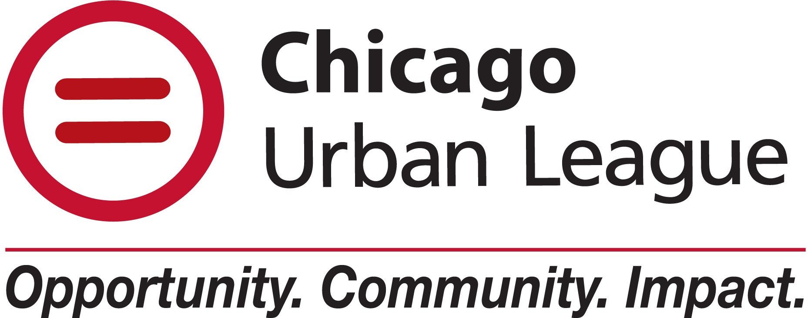
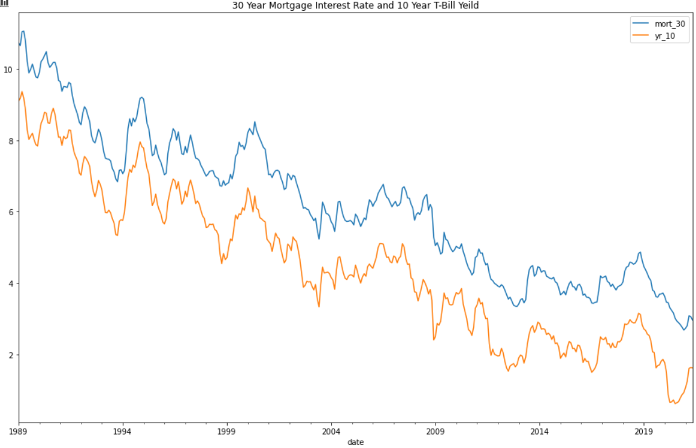
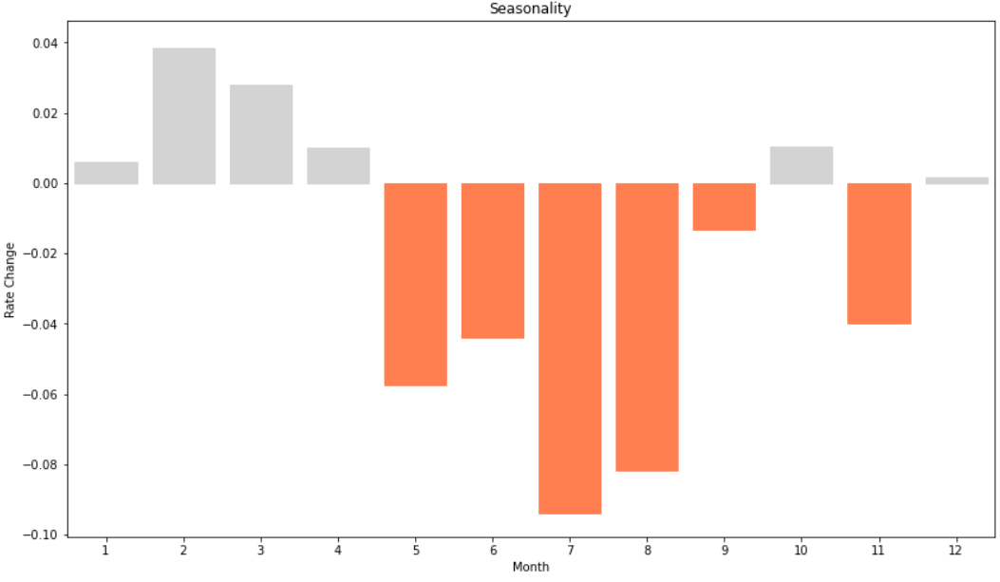
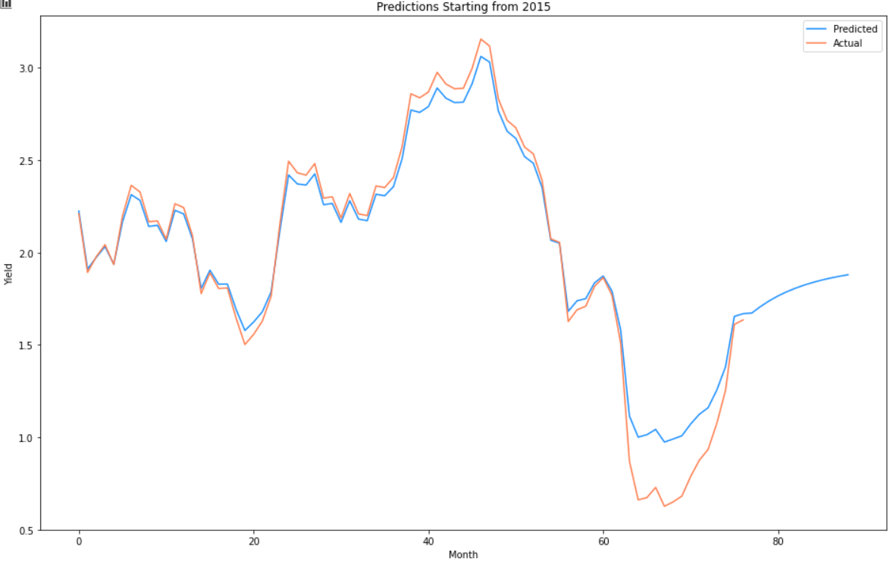

# Predicting Long Term Interest Rates for The Urban League


**Author**: [Mohammed Siddiqui](mailto:siddiqui.mohammed.m@gmail.com)

## **Overview**
 
* The Urban League of Chicago would like to help low income clients choose loans for long term mortgages

* This project aims to help clients decide between Fixed Rate Loans and Adjustable Rate Loans for clients.

## **Business Problem**


* Which type of loan is recommended for each client?
* When is the best time to take a loan?


## **Data**

* The main source of data we worked with was the 10 Year Treasury bond yields, from The Federal Reserve Bank of St. Louis.

* Data covered 1989 to the present.

## **Methods**

We utilized the following models:

* ARMA
* ARIMA
* SARIMA
* Recurrent Neural Network LSTM

## **Results**

### **Relationship: Mortgage Rates and Treasury Yields**

* 30 Year Mortgage rates follow the pattern from 10 Year Treasury Yields.

* Pearson Correlation: 0.99



### **Seasonality**

* Yields decrease from May to September.




### **Prediction: 10 Year Treasury Bill**

* Our model predicts the yields will increase.

* Mean Absolute Error: 0.15



## **Recommendations**

* Choose Fixed Rate Loan over Adjustable Rate Loan
* Take loans as soon as possible
* Prioritize taking loans between May and September


## **Next Steps**

* Acquire more microeconomic data in order to run multivariate analysis.
* Examine the effects of credit score
* Examine and predict trends in housing prices
## **For More Information**

See the full analysis in the [Jupyter Notebook](t_bill_forecast.ipynb)

For additional info, I can be reached at  at [siddiqui.mohammed.m@gmail.com](mailto:siddiqui.mohammed.m@gmail.com)


## Repository Structure

```
├── data
├── images
├── README.md
└── t_bill_forecast.ipynb
```